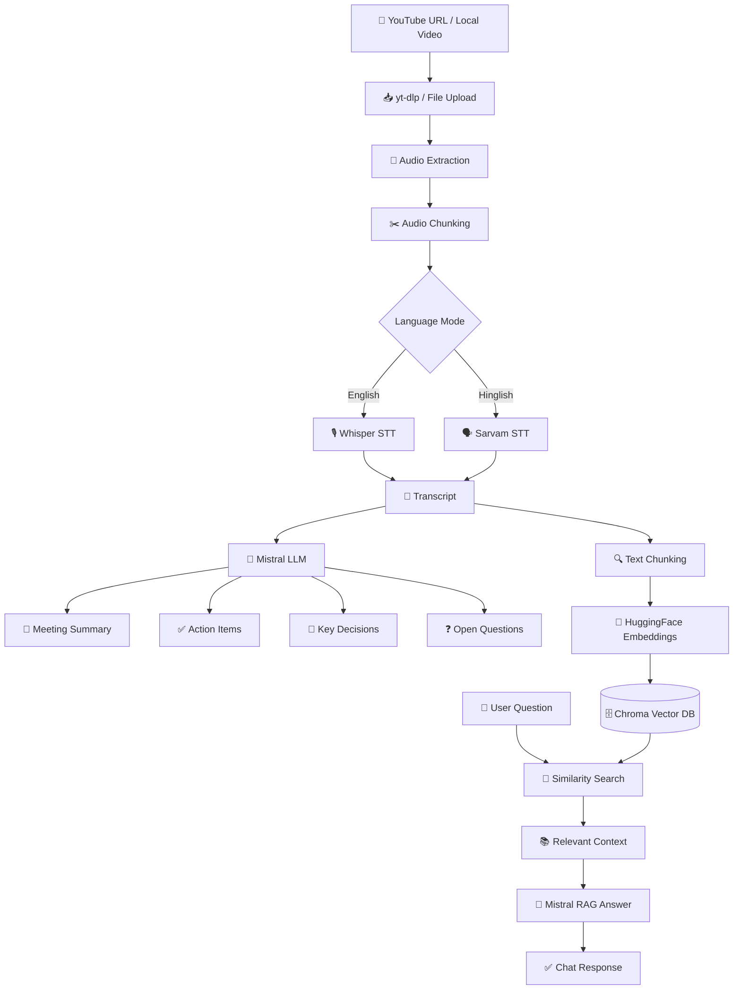

# 🏗️ Architecture

## System Architecture



---
live Demeo = https://ai-video-analyzer-rmbrjfemqfzosappyt3jmx.streamlit.app/
# 🔄 Workflow

## 1️⃣ Video Input

Users can provide:

* YouTube URL
* Local Video File
* Local Audio File

```python
source = input("Enter YouTube URL or file path:")
```

---

## 2️⃣ Audio Extraction

Video is converted into audio using ffmpeg.

```python
ffmpeg.input(video_path).output(audio_path).run()
```

---

## 3️⃣ Audio Chunking

Long audio files are split into manageable chunks.

```python
chunks = split_audio(audio_file)
```

Benefits:

* Faster transcription
* Lower memory usage
* Better processing reliability

---

## 4️⃣ Speech-to-Text

### English Mode

Uses OpenAI Whisper.

```python
model = whisper.load_model("base")
result = model.transcribe(audio_path)
```

### Hinglish Mode

Uses Sarvam AI.

```python
response = sarvam.transcribe(audio_file)
```

Output:

```text
Raw Transcript
```

---

## 5️⃣ AI Analysis

Transcript is sent to Mistral LLM.

Generated outputs:

* Meeting Title
* Executive Summary
* Action Items
* Key Decisions
* Open Questions

```python
response = llm.invoke(prompt)
```

---

## 6️⃣ RAG Index Creation

Transcript is split into chunks.

```python
chunks = text_splitter.split_text(transcript)
```

Embeddings are generated.

```python
embeddings = HuggingFaceEmbeddings()
```

Stored in Chroma.

```python
vectorstore = Chroma.from_documents(
    chunks,
    embeddings
)
```

---

## 7️⃣ Interactive Chat

Users can ask questions like:

* What were the action items?
* What deadlines were discussed?
* Summarize the discussion about budget.
* Who was assigned which task?

Query flow:

```text
User Query
     │
     ▼
Similarity Search
     │
     ▼
Relevant Chunks
     │
     ▼
Mistral LLM
     │
     ▼
Answer
```

---

# 📊 Data Flow

```text
Video / Audio Input
        │
        ▼
Audio Extraction
        │
        ▼
Audio Chunking
        │
        ▼
Speech-to-Text
        │
        ▼
Transcript
        │
 ┌──────┴────────┐
 ▼               ▼
Meeting AI      RAG Pipeline
Analysis        (Embeddings)
 ▼               ▼
Summary       ChromaDB
Action Items      │
Decisions         ▼
Questions     Semantic Search
      \          /
       \        /
        ▼      ▼
      User Chat
```

---

# 🛠️ Technology Stack

| Layer              | Technology            |
| ------------------ | --------------------- |
| Frontend           | Streamlit             |
| Video Download     | yt-dlp                |
| Audio Processing   | ffmpeg, pydub         |
| Speech Recognition | Whisper, Sarvam       |
| LLM                | Mistral AI            |
| Framework          | LangChain             |
| Embeddings         | sentence-transformers |
| Vector Database    | ChromaDB              |
| RAG Engine         | LangChain Retriever   |
| Language           | Python                |

---

# 🎯 Use Cases

* Meeting Intelligence
* Lecture Analysis
* Podcast Summarization
* Interview Analysis
* YouTube Video Summaries
* Team Standups
* Research Discussions
* Educational Content Q&A

---

# 🚀 Future Improvements

* Multi-video knowledge base
* Speaker diarization
* Timestamp citations
* Real-time transcription
* PDF export
* Meeting minutes generation
* Team collaboration
* Cloud deployment
* Multilingual support
* Voice-based chat

```
```
